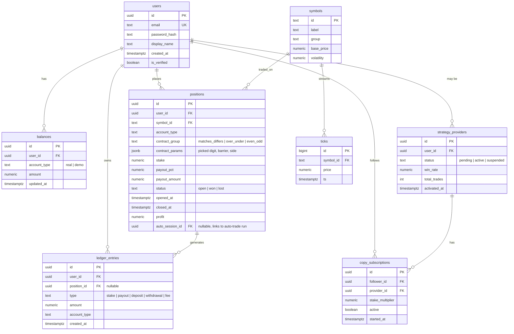

# Backend Implementation Plan — Dash Clone

**Status:** Planning document. Nothing in this file is implemented yet except where noted as "current scaffold."
**Companion to:** `backend/` (FastAPI scaffold), `frontend/` (React app, currently fully self-contained with a client-side mock trading engine).

---

## 0. Scope & guardrails

This project is a **portfolio/learning clone** of dashbinary.com's trading UI. That framing carries directly into this plan:

- Everything described here — accounts, balances, contract settlement, positions, copy trading — is built as a **fully functional simulation**. Real persistence, real auth, real WebSockets, real settlement math. Nothing about it is a toy.
- **Real money never moves.** Deposits, withdrawals, and "Real" balances stay simulated ledger entries. Section 13 documents what it would actually take to process real payments, precisely so that boundary is explicit and not something to cross by accident.
- Binary-options-style products (fixed-odds contracts on synthetic indices) are tightly regulated or banned outright for retail customers in major jurisdictions (EU/ESMA, UK/FCA, US/CFTC, and others), and licensing requirements vary sharply by country. If this project is ever repurposed to handle real funds, that needs a licensing review by a lawyer in every jurisdiction it would operate in — before any of section 13 gets built, not after.

Everything in sections 1–12 and 14–20 is safe to build as described: it's standard backend engineering for a simulated trading app. Section 13 is intentionally written as "here is what production would require," not a build guide.

---

## 1. Architecture overview

```mermaid
flowchart LR
    subgraph Client
        FE[React SPA]
    end

    subgraph API["FastAPI service"]
        REST[REST API]
        WS[WebSocket gateway]
        WORKER[Background workers\n(auto-trade engine, settlement)]
    end

    subgraph Data
        PG[(PostgreSQL)]
        REDIS[(Redis)]
    end

    FE <-- HTTPS/JSON --> REST
    FE <-- WSS --> WS
    REST --> PG
    REST --> REDIS
    WS --> REDIS
    WORKER --> PG
    WORKER --> REDIS
    WORKER -.publishes ticks/settlements.-> REDIS
```

**Why this shape:**
- **Redis pub/sub** decouples the tick generator and settlement worker from however many WebSocket connections are open — any API process can subscribe and fan out to its own connected clients, so the API layer can scale horizontally.
- **One Postgres instance** is the source of truth for everything durable (users, balances, positions, ledger entries). Redis is disposable/cache-only — nothing lives there that can't be regenerated from Postgres.
- **Background workers** run the synthetic index generator (section 5) and the auto-trade evaluation loop (section 7) as long-running async tasks, separate from request/response handlers.

---

## 2. Tech stack

| Layer | Choice | Why |
|---|---|---|
| API framework | FastAPI (already scaffolded) | async-native, typed, matches the existing `backend/` code |
| DB | PostgreSQL 16 | relational integrity for ledgers/positions matters; JSONB where flexibility is needed |
| ORM | SQLAlchemy 2.0 (async) + Alembic | typed models, real migrations |
| Cache/pub-sub | Redis 7 | tick fan-out, rate limiting, session/token blocklist |
| Auth | JWT (access + refresh) via `python-jose`, `passlib[bcrypt]` for password hashing | stateless access tokens, revocable refresh tokens |
| WebSockets | native FastAPI/Starlette WS + Redis pub/sub bridge | no extra broker needed at this scale |
| Background jobs | `asyncio` tasks for the tick engine; APScheduler or a dedicated worker process for auto-trade evaluation | keep it simple until load requires Celery/RQ |
| Validation | Pydantic v2 (already in use) | already the scaffold's pattern |
| Testing | pytest + pytest-asyncio + httpx `AsyncClient` | standard FastAPI testing stack |

---

## 3. Data model



Notes:
- `positions.contract_params` is JSONB because the three contract groups have different shapes (a picked digit, a barrier, or just a side) — trying to force them into shared columns creates a lot of nullable noise.
- `ledger_entries` is an append-only audit trail. `balances.amount` is a denormalized running total for fast reads, recomputed/reconciled against the ledger on a schedule (or on every write inside the same transaction) so the two can never silently drift.
- Every `positions` and `ledger_entries` row is scoped to `account_type` (`real`/`demo`) — the two ledgers never mix, mirroring the frontend's existing Real/Demo split.

---

## 4. Auth & accounts

- **Registration / login:** email + password, bcrypt-hashed. Issue a short-lived JWT access token (~15 min) and a longer-lived refresh token (~30 days) stored as an `httpOnly` cookie. Refresh tokens are tracked in Redis (or a `refresh_tokens` table) so they can be revoked on logout/password change.
- **Two-Factor Auth** (already a stub page in the frontend, `/settings/2fa`): TOTP-based (`pyotp`), no third party needed — standard authenticator-app flow.
- **Password reset / email verification:** needs an email-sending provider (see section 14) since FastAPI can't deliver email itself.
- **Session model:** every WebSocket connection authenticates via the same JWT (passed as a query param or subprotocol header on connect), resolved once, then cached on the connection object — don't re-verify on every message.
- **New user bootstrap:** on registration, create a `demo` balance row seeded at $10,000 (matching current frontend behavior) and a `real` balance row at $0.00.

---

## 5. Synthetic market engine

This is the part that's easy to get wrong by assuming it needs "real market data." **It doesn't.** The reference site's "Volatility Indices" aren't sourced from any exchange — Deriv (the platform this UI pattern comes from) generates them synthetically with a published, fixed-volatility random-walk algorithm precisely so the odds are independent of any real market and can run 24/7. This project should do the same, which also means **no third-party market data subscription is required anywhere in this plan.**

**Design:**
1. Each symbol (`Volatility 10 (1s) Index`, `Volatility 30 Index`, etc.) has a fixed `base_price` and `volatility` parameter (already present in `frontend/src/hooks/usePriceFeed.ts` as `basePrice` and the `0.0015` drift factor — port that logic server-side as the source of truth).
2. A background task per active symbol ticks every 1s (or 2s for the non-`(1s)` variants, matching their naming), applying `price += (random() - 0.5) * price * volatility`, and:
   - writes the tick to Postgres (`ticks` table, or a time-series-friendly store — see the scale note below),
   - publishes it to the symbol's Redis channel for WebSocket fan-out.
3. **Provably fair (recommended, not required):** seed each tick's RNG from `HMAC(server_secret, tick_index)`, and periodically publish the previous period's `server_secret` so users can independently verify the sequence wasn't tampered with after the fact. This is the standard pattern casinos/prediction markets use ("provably fair") and directly addresses the trust problem inherent in "the house generates the numbers that decide payouts." Worth doing even for a portfolio project — it's a good conversation piece in an interview.
4. **Scale note:** ticks are high-volume, append-only, time-ordered data. If `ticks` grows large, swap the table for TimescaleDB (a Postgres extension) or just prune anything older than the digit-history window the UI actually uses (currently 40 ticks, per `DIGIT_WINDOW` in the frontend hook) — there's no product reason to keep tick history forever.

---

## 6. Contract pricing & settlement

Three contract groups, all resolved against the **last digit of the tick price** (matching the frontend's `lastDigit` logic):

| Contract | Resolves when | Win condition |
|---|---|---|
| Even/Odd | next tick lands | last digit is even/odd |
| Matches/Differs | next tick lands | last digit equals/differs from the picked digit |
| Over/Under | next tick lands | last digit is over/under the picked barrier |

**Payout formula** (port `frontend/src/lib/payouts.ts` server-side — it must not live only in the frontend, since the client can't be trusted to compute its own payout):

```
payout_pct = ((1 / true_probability) - 1) * 100 * house_edge
```

with `house_edge` around 0.95 (a 5% edge), and `true_probability` computed from the digit's actual theoretical odds (1/10 for a specific digit match, (10-barrier)/10 for "over", etc. — exactly what the frontend already does).

**Settlement flow:**
1. `POST /api/trades` validates the stake against balance, debits it inside a DB transaction, inserts the `position` row (`status=open`) and a `ledger_entries` row (`type=stake`), and returns immediately.
2. The settlement worker (part of the tick loop) checks open positions against each new tick as it's generated, resolves any that match, credits the payout for winners inside a transaction, and updates `status`/`profit`/`closed_at`.
3. The result is pushed to the user over their WebSocket connection (`position.update` event) so the frontend updates without polling.

This mirrors what `AccountContext.tsx`'s `placeTrade` mock does today (a 4-second `setTimeout` with a random win check) — the backend version just makes the "random win check" an actual tick-driven resolution instead of a fixed timer, which is both more correct and removes the last piece of trust the client currently has to be given.

---

## 7. Trade modes & the auto-trade engine

- **Manual mode** is just section 6 — one contract per click.
- **Auto mode** (Target Profit / Target Loss / Loss Multiple, already in the UI) needs a small stateful runner:
  - `auto_sessions` table: `user_id`, `symbol_id`, `contract_group`, `contract_params`, `base_stake`, `target_profit`, `target_loss`, `loss_multiple`, `status (running|stopped)`, `session_pl`.
  - On each settlement of a position belonging to an active auto session: update `session_pl`; if it lost, next stake = `base_stake * loss_multiple^consecutive_losses` (capped at "max 8 steps," matching the UI copy); if `session_pl >= target_profit` or `<= -target_loss`, stop the session and place no further trades.
  - This runs as part of the same settlement worker from section 6 — no separate process needed.

---

## 8. Real-time layer (WebSocket)

| Channel | Direction | Payload |
|---|---|---|
| `/ws/ticks/{symbol_id}` | server → client | `{time, price}` per tick (already scaffolded in `backend/app/routers/market.py`, currently unauthenticated and self-contained — needs to move to reading from the Redis-published tick stream from section 5 instead of generating its own random walk per connection) |
| `/ws/account` | server → client | balance updates, position open/settle events, auto-session state changes |
| `/ws/positions` | server → client | live open-position P/L if contracts ever support early exit (not in the current UI, future consideration) |

One authenticated connection per user multiplexing `/ws/account` avoids the client needing N sockets. Ticks can stay a separate unauthenticated public channel per symbol (price data isn't sensitive) so it can be cached/shared across all viewers of that symbol.

---

## 9. REST API reference

Current scaffold (`backend/app/routers/`) already has the shape of this; this is the full surface it should grow into.

| Method | Path | Purpose | Auth |
|---|---|---|---|
| `POST` | `/api/auth/register` | create account | — |
| `POST` | `/api/auth/login` | issue tokens | — |
| `POST` | `/api/auth/refresh` | rotate access token | refresh cookie |
| `POST` | `/api/auth/logout` | revoke refresh token | ✓ |
| `GET` | `/api/account/balance` | current real/demo balances | ✓ |
| `POST` | `/api/account/reset-demo` | reset demo to $10,000 | ✓ |
| `GET` | `/api/market/symbols` | list tradable symbols | — |
| `WS` | `/ws/ticks/{symbol_id}` | live price stream | — |
| `POST` | `/api/trades` | place a manual contract | ✓ |
| `POST` | `/api/trades/auto` | start an auto-trade session | ✓ |
| `POST` | `/api/trades/auto/{id}/stop` | stop a running auto session | ✓ |
| `GET` | `/api/positions?status=open\|closed` | list positions | ✓ |
| `GET` | `/api/positions/transactions` | ledger view (stakes + payouts) | ✓ |
| `WS` | `/ws/account` | balance/position push updates | ✓ |
| `GET` | `/api/copy-trading/providers` | strategy marketplace listing | — |
| `POST` | `/api/copy-trading/providers/{id}/subscribe` | follow a provider (deducts activation fee) | ✓ |
| `POST` | `/api/copy-trading/become-provider` | apply once eligibility criteria are met | ✓ |
| `GET` | `/api/settings/profile` / `PATCH` | profile fields | ✓ |
| `POST` | `/api/settings/2fa/enable` / `/verify` | TOTP setup | ✓ |

---

## 10. Positions, history, transactions

Straightforward reads over the tables in section 3:
- **Open/Closed tabs** → `positions` filtered by `status`, paginated, newest first.
- **Transactions tab** → `ledger_entries` joined to `positions` for context, split by `type` for the Deposits/Withdrawals modal tabs already in the UI (`HistoryModal.tsx`).
- **Session summary** (`Last Session`, `Session P/L`) → aggregate over positions opened since the user's last "session start" marker (simplest definition: since local midnight, or since app was last opened — pick one and document it, since the frontend currently just resets this per page load).

---

## 11. Copy trading backend

Matches the `CopyTradingPage.tsx` UI already built:
- **Becoming a provider:** gated on the same three requirements shown in the UI (≥20 completed trades, positive 30-day P/L, ≥55% win rate) — compute these from `positions` on a schedule (nightly job) rather than live on every page load, and cache the result on `strategy_providers`.
- **Subscribing:** requires `balances.real >= 100`, deducts a one-time $100 activation fee (a `ledger_entries` row, `type=fee`) into... nowhere, in a pure simulation (or a platform-revenue ledger if you want the books to balance conceptually).
- **Mirroring trades:** when a provider places a trade, enqueue a mirrored trade (scaled by each follower's `stake_multiplier`) for every active subscriber. This is the one place where "instant" matters — do it synchronously right after the provider's trade is accepted, not on a delayed batch job, or followers' fills will lag the provider's price.

---

## 12. Notifications

The UI has a bell icon with no behavior yet. In-app notifications (position settled, auto-session stopped, someone you copy placed a trade) can be:
- Pushed live over `/ws/account` while the user is online, and
- Persisted to a `notifications` table for the bell's unread badge/history when they're not.

No third party needed for in-app notifications. Email/push notifications (section 14) would need a provider if ever added.

---

## 13. Payments & withdrawals — path to production (out of scope for this build)

This section documents what real money support would require. **None of it should be built until there's a licensing sign-off from a lawyer covering every jurisdiction the platform would operate in** — the "Learn about this trade type" fixed-odds product this UI clones is specifically the kind of instrument that's banned for retail in the EU/UK and tightly restricted in the US.

If that sign-off exists, here's the shape of it:

| Need | Third-party options | Why you can't self-build it |
|---|---|---|
| **Money transmission / gambling-derivatives license** | Jurisdiction-specific regulator (e.g., in Kenya: CMA; in the EU: national financial regulators under MiFID/ESMA rules; in the UK: FCA) | This is a legal license, not a technical integration — required before touching real customer funds at all |
| **M-Pesa deposits/withdrawals** | Safaricom Daraja API (STK Push for deposits, B2C for withdrawals) | M-Pesa is a closed mobile-money network; only Safaricom's own API can move money on it |
| **Card payments** | A PCI-DSS Level 1 compliant processor (Stripe, Flutterwave, Paystack) using their hosted/tokenized checkout | Handling raw card numbers yourself puts the whole platform in PCI-DSS scope — always use hosted checkout instead |
| **Crypto (USDT TRC20) deposits/withdrawals** | A custodial wallet/exchange provider (e.g., Fireblocks, BitGo) or a payment processor with crypto rails (e.g., Coinbase Commerce) rather than self-hosting a hot wallet | Self-custody of user funds is its own regulatory and security liability (private key management, chain-reorg handling, AML screening on incoming addresses) |
| **AML transaction monitoring** | A provider like ComplyAdvantage or Chainalysis (for the crypto leg) | Sanctions/AML screening lists are maintained by specialized providers, not something to hand-roll |

**Technical shape once licensed:** payments become an event-driven subsystem — a provider webhook (M-Pesa callback, Stripe webhook, deposit-address monitor) lands on a `POST /api/webhooks/{provider}` endpoint, verified by signature, which writes a `ledger_entries` row and updates `balances.real` inside one transaction, idempotent on the provider's transaction ID so retried webhooks can't double-credit an account.

---

## 14. Identity verification (KYC) & email delivery

Two more third-party needs, both real (unlike section 13, these are low-risk to integrate even for a demo, since they don't move money):

- **KYC** (`/settings/verify` — already a stub page): a provider like Sumsub, Onfido, or Smile Identity (Africa-focused, relevant given the M-Pesa context in the UI) handles document capture + liveness check + sanctions screening, and posts a webhook back with a verified/rejected result. Only relevant once section 13 is live — no point verifying identity for a platform that never moves real money.
- **Transactional email** (password reset, verification codes, deposit/withdrawal receipts once real): any of SendGrid, Postmark, or AWS SES via SMTP or their REST APIs. Needed regardless of section 13, since password reset alone requires it.

---

## 15. Live chat

The frontend already has a `ChatWidget.tsx` with a note that it's a demo widget with no backend. Two paths:
- **Third-party** (fastest to real functionality): Intercom, Crisp, or Tawk.to — drop in their JS snippet, done, no backend work at all.
- **Custom** (more work, no ongoing per-seat cost): a `chat_messages` table + a WebSocket channel per conversation + a basic agent-side view. Only worth building custom if live chat is meant to be a showcased feature of this specific project rather than an incidental one.

---

## 16. Infrastructure & deployment

| Component | Suggested host | Notes |
|---|---|---|
| Frontend | Vercel (already set up) | static, no change needed |
| API + WebSocket | Railway, Render, or Fly.io | all three support long-lived WebSocket connections on a standard web service, unlike serverless platforms (Vercel functions aren't a good fit for the WS + background-worker parts of this backend) |
| Postgres | Supabase, Neon, or the host's managed Postgres (Railway/Render both offer one) | managed backups + connection pooling out of the box |
| Redis | Upstash (serverless-friendly, pay-per-request) or the host's managed Redis | |
| Background workers | same process as the API for now (an `asyncio` task started on app startup); split into a separate worker service once load justifies it | avoid the complexity of a separate deploy until there's a real reason for it |
| Secrets | host's built-in environment variable management | JWT signing key, DB URL, Redis URL, (later) payment provider keys |

**CORS:** update `backend/app/main.py`'s `allow_origins` from `http://localhost:5173` to the deployed Vercel domain(s) once both sides are live.

---

## 17. Security

- All money-affecting endpoints (`/api/trades*`, `/api/account/*`) require auth and re-validate ownership server-side — never trust a `user_id` from the client.
- Rate-limit `/api/trades` per user (Redis token bucket) — nothing in the current frontend throttles trade placement, so the backend needs to be the one place that does.
- WebSocket auth: verify the JWT on connect; reject the upgrade if invalid rather than accepting and closing later.
- Input validation via Pydantic is already the pattern (see `PlaceTradeRequest` in the scaffold) — keep that discipline as the surface grows, especially `contract_params`, since it's JSONB and easy to under-validate.
- Structured audit logging on every balance-affecting transaction (who, what, when, resulting balance) — this is what makes `ledger_entries` actually useful for debugging "why is this balance wrong" later.

---

## 18. Observability & testing

- **Testing:** pytest against a test Postgres (via `testcontainers` or a Docker Compose test DB), covering: settlement math (the payout formulas in section 6 are exactly the kind of code that silently drifts from the frontend copy if not tested against known inputs), the auto-trade loss-multiple progression, and balance-never-goes-negative invariants.
- **Observability:** structured logging (`structlog`) from day one; add Sentry (error tracking) and a basic `/health` + `/metrics` endpoint once deployed, so a broken tick loop or stuck auto-session doesn't go unnoticed silently.

---

## 19. Third-party integrations — summary table

| Integration | Needed for | Required for this demo? |
|---|---|---|
| Provably-fair RNG (self-built, no external service) | trustworthy synthetic prices | recommended, not required |
| Email provider (SendGrid/Postmark/SES) | password reset, verification | yes, if auth ships |
| Sentry | error tracking | recommended |
| Upstash/managed Redis | tick fan-out, rate limiting | yes, once WS moves off in-process |
| Managed Postgres | durable storage | yes |
| M-Pesa (Daraja API) | real deposits/withdrawals | **no — requires licensing first** |
| Card processor (Stripe/Flutterwave) | real card payments | **no — requires licensing first** |
| Crypto custodian | real USDT deposits/withdrawals | **no — requires licensing first** |
| KYC provider (Sumsub/Onfido/Smile ID) | identity verification | **no — only relevant once real money is live** |
| AML screening (ComplyAdvantage/Chainalysis) | transaction monitoring | **no — only relevant once real money is live** |
| Live chat (Intercom/Crisp/Tawk.to) | support widget | optional, fastest path if wanted |

---

## 20. Phased roadmap

1. **Foundation** — Postgres + SQLAlchemy models + Alembic migrations for section 3's schema; auth (register/login/JWT); port the tick engine (section 5) to run server-side and replace the frontend's local `usePriceFeed` with a WebSocket connection to it.
2. **Trading core** — server-side settlement (section 6), manual trades wired end-to-end (frontend `AccountContext.placeTrade` → real `POST /api/trades`), positions/history endpoints replacing the frontend's local state.
3. **Auto-trade** — the auto-session engine (section 7), wired to the UI's existing Target Profit/Loss/Loss Multiple controls.
4. **Copy trading** — schema + endpoints from section 11, wired to the existing `CopyTradingPage.tsx`.
5. **Polish** — notifications, 2FA, email delivery, rate limiting, observability.
6. **(Gated on legal sign-off)** — payments, KYC, AML, as scoped in sections 13–14.

Each phase should leave the app in a fully working, demoable state — nothing here requires the whole backend to land at once before the frontend can start using pieces of it.
