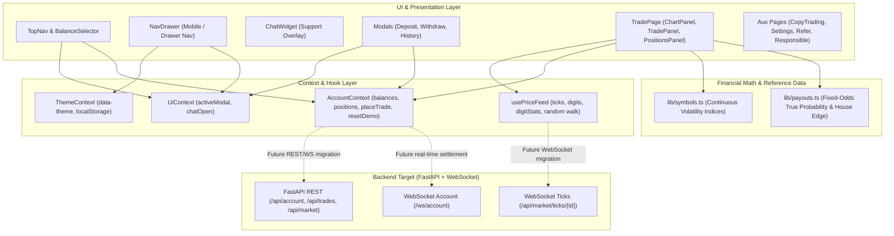
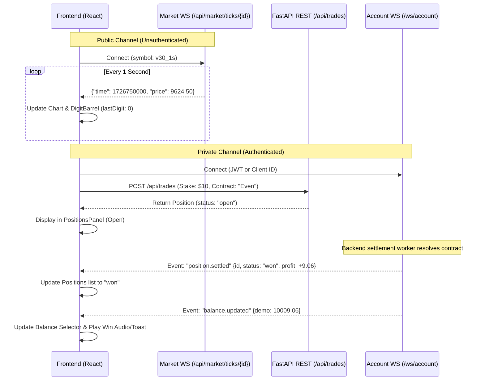

# Frontend Deep Dive & Implementation Roadmap — Dash Clone

**Companion to:** [`docs/BACKEND_PLAN.md`](BACKEND_PLAN.md), [`frontend/`](../frontend/), [`backend/`](../backend/)  
**Version:** 1.0.0  
**Status:** In Progress / Pre-Integration Architecture Review  

---

## 1. Executive Summary & Architectural Overview

The frontend is a single-page application (SPA) replicating the high-frequency trading dashboard UI of [dashbinary.com](https://dashbinary.com) (a Deriv-style fixed-odds binary and synthetic volatility indices trading platform). It is built with **React 19**, **TypeScript 6**, and **Tailwind CSS v4** (using the new `@tailwindcss/vite` compiler plugin) powered by **Vite 8**.

Currently, the frontend is **self-contained and decoupled from the backend**. It runs on an in-browser simulated price feed (`usePriceFeed.ts`) and a mock account/settlement state machine (`AccountContext.tsx`). The application renders a dark navy theme (matching the live Dash platform), high-density typography, live digit statistical distributions, interactive contract pickers, and responsive multi-column layouts.



### Key Technical Characteristics
1. **Framework & Tooling:** Modern React 19.2 + Vite 8.3 with Oxlint configured for linting. Zero legacy CRA or Webpack overhead.
2. **Styling & Design System:** Tailwind CSS v4 using CSS variable binding (`--bg`, `--panel`, `--line`, `--teal`, `--red`, `--muted`). Supports light and dark modes with dark as default. Custom scrollbars and tabular numbers are enabled for high-density financial data.
3. **Layout Dynamics:** Desktop features a 3-column layout (`PositionsPanel` [300px] · `ChartPanel` [flex-1] · `TradePanel` [380px]). Below the `xl` breakpoint (1280px), it collapses to a single column with a mobile bottom navigation bar toggling between "Trade" and "Positions".
4. **Contract Models Covered:** Three core Deriv-style binary contract types:
   - **Even/Odd** (50/50 baseline probability on the last decimal digit of the tick price)
   - **Matches/Differs** (10% match vs 90% differs probability against a selected digit 0–9)
   - **Over/Under** (Variable odds based on whether the last digit is strictly above or below a barrier digit 0–9)

---

## 2. Component & Module Deep Dive

### 2.1 Routing & Application Shell
- **`src/App.tsx` & `src/main.tsx`:** Configured with `react-router-dom` v7. Wrap the application tree with `ThemeProvider` → `AccountProvider` → `UiProvider`.
- **Layout Architecture (`src/layout/AppLayout.tsx`):**
  - High-level layout container managing global modal overlays (`DepositModal`, `WithdrawModal`, `HistoryModal`), the slide-out `NavDrawer`, and the floating `ChatWidget`.
  - Employs an `Outlet` inside a flex container with `h-dvh` to ensure zero vertical bounce on mobile Safari/Chrome.

### 2.2 Navigation & Account Bar
- **`src/layout/TopNav.tsx`:** Desktop header bar with quick links (`Trader's Hub`, `Deposit`, `Withdraw`, `History`, `Copy Trading`, `Chat`), balance dropdown badge, Settings cog, and notification bell icon.
- **`src/layout/BalanceSelector.tsx`:** Modal/popover dropdown displaying live Real and Demo balances. Allows instant switching between Real and Demo accounts, and contains a demo reset trigger (`↺ Reset demo to $10,000`).
- **`src/layout/NavDrawer.tsx`:** Slide-over navigation for viewports `< xl`. Contains user profile summary, links to account subpages, theme switch toggle (Dark/Light), and action buttons for modals.

### 2.3 Trading Core Engine (Client-Side Simulation)

#### `src/pages/TradePage.tsx`
Orchestrates the responsive trading layout. Maintains the currently active trading `symbol` state (defaults to `Volatility 30 (1s) Index`). Below `xl`, it manages the `mobileView` state (`'trade' | 'positions'`).

#### `src/components/trade/ChartPanel.tsx`
- **Charting Engine:** Built with `recharts` (`AreaChart`, `Area`, `CartesianGrid`, `YAxis`, `ResponsiveContainer`).
- **Data Source:** Pulls from `usePriceFeed(symbol.id)`. Maintains an area gradient using `--color-teal`.
- **Price Tag Overlay:** Calculates a live dynamic badge on the Y-axis pinned to the current spot price.
- **Micro-tools:** Includes top-left interval toggle (`1T`), technical chart tool icons (inert buttons), and bottom-left zoom controls (`+`, `-`, target center).
- **Digit Distribution Bar (`src/components/trade/DigitBarrel.tsx`):** Displays horizontal statistics for digits `0` through `9`, highlighting the lowest frequency digit (red), highest frequency digit (teal), and the latest tick's last digit with an amber pointer.

#### `src/components/trade/TradePanel.tsx`
The primary interaction surface for order placement.
- **Contract Group Selector:** Toggles between `Matches/Differs`, `Over/Under`, and `Even/Odd`.
- **Mode Toggle:** Toggles between `Auto` (Target Profit, Target Loss, Loss Multiple) and `Manual`.
- **Stake Mode Toggle:** Toggles between `Stake` (input stake directly) and `Payout` (intended to compute stake from desired payout).
- **Stake Adjustment:** Minus/Plus buttons, direct number input, and quick-add pills (`+1`, `+5`, `+10`, `+25`, `+50`).
- **Digit / Barrier Pickers:** 10-button digit grid (0–9) rendered dynamically when in `Matches/Differs` or `Over/Under` mode.
- **Live Clock:** Real-time GMT clock with blinking/green operational status indicator.
- **Outcome Action Buttons:** Dual action buttons with payout percentage and calculated USD payout display.

#### `src/components/trade/PositionsPanel.tsx`
- Displays active and resolved trades across three tabs: `Open`, `Closed`, and `Transactions`.
- Calculates aggregate session stats: total trades, win count, loss count, and net Session P/L (`sessionPl`).

### 2.4 Mathematical Models & Price Feeds

#### `src/lib/payouts.ts`
Applies a house edge factor (`EDGE = 0.953`, i.e., ~4.7% house edge) over true probability:
$$\text{Payout \%} = \max\left(0, \left(\frac{1}{p} - 1\right) \times 100 \times \text{EDGE}\right)$$
- **Even/Odd ($p = 0.5$):** Payout is $90.6\%$.
- **Matches ($p = 0.1$):** Payout is $857.7\%$.
- **Differs ($p = 0.9$):** Payout is $10.59\%$.
- **Over/Under:** Dynamically calculates $p$ based on barrier position $B \in \{0..9\}$.

#### `src/hooks/usePriceFeed.ts`
Generates a 1-second random-walk simulation:
$$\text{drift} = (\text{random}() - 0.5) \times \text{price} \times 0.0015$$
Maintains a rolling buffer of 60 ticks for the chart and 40 ticks for digit distribution analysis. Extracts `lastDigit` using string representation: `price.toFixed(2).replace('.', '').slice(-1)`.

#### `src/context/AccountContext.tsx`
Provides global account state:
- `balances`: `{ real: number, demo: number }` (initialized to Real: $0.00, Demo: $10,000.00).
- `positions`: List of `Position` objects.
- `placeTrade`: Deducts stake immediately, registers position with status `open`, and schedules a 4-second resolution timer simulating contract expiry.

---

## 3. Comprehensive Audit: Gaps, Polish & Deficiencies

An itemized review of the current implementation reveals several functional, visual, and architectural gaps that must be resolved before production and backend integration.

### 3.1 Trading Logic & Form Gaps

| Area | Observed Gap / Issue | Impact | Recommended Solution |
|---|---|---|---|
| **Stake vs Payout Mode** | Toggling `stakeMode` to `'payout'` alters the button state, but the input continues to bind to `stake`. Payout is never calculated inversely. | High UX confusion | When in `payout` mode, input edits desired payout $P$. Compute required stake: $S = P / (1 + \text{payoutPct}/100)$. |
| **Auto-Trading Mode** | Target Profit, Target Loss, and Loss Multiple fields exist, but clicking an outcome button only executes a single trade. No execution loop, no Martingale multiplier step progression, no stop conditions. | High feature gap | Implement a client-side (and backend-ready) state machine for auto-sessions: tracks session P/L, runs consecutive trades on tick settlement, multiplies stake on loss ($S \times M$), and stops on target profit/loss. |
| **Session Summary Desync** | `TradePanel.tsx` hardcodes `0 trades (0W / 0L)` and `+0.00 USD` (lines 208–214), whereas `PositionsPanel.tsx` computes live session metrics. | Visual bug | Connect `TradePanel`'s session counters directly to `AccountContext` metrics. |
| **Stake Validation** | If `stake <= 0` or `stake > balance`, `TradePanel.tsx` silently exits (`if (stake <= 0 || stake > balance) return`). | Poor UX | Add visual error feedback: input border turns red, button becomes disabled with an explanatory tooltip (e.g., "Insufficient balance"). |
| **Stake Input Edge Cases** | Clearing the stake input passes `0` or `NaN` into state. Negative values can be entered via keyboard. | Input validation bug | Sanitize input: clamp `Math.max(1, value)`, prevent non-numeric entry, and format to 2 decimal places. |
| **Even/Odd Progress Bar** | `OutcomeButton` renders a progress bar using `barPct = Math.min(100, payoutPct)`. Both Even and Odd have ~90.6% payout, so both bars are permanently static at 90.6%. | Misleading visual | Change the progress bar to show the live digit statistical distribution for Even vs Odd digits from `digitStats`. |
| **Fullscreen Mode** | Clicking the Expand icon renders `TradePanel` fixed over the viewport, hiding the chart and navigation without a clear close/collapse header button. | Layout trap | Add an explicit "Exit Fullscreen" header button with an `Esc` key listener. |
| **Inert Controls** | "AI Scanner", "Learn about this trade type", and the Chart toolbar (`1T`, indicators, pen, download, zoom) are inert buttons without handlers. | Visual polish | Either implement functional popovers/modals (e.g. Contract Explainer modal, AI Pattern Scanner modal) or visually disable/badge them as "Demo / Simulated". |

### 3.2 Positions & Ledger Panel

1. **Inert Close Button:** The `X` button on the `PositionsPanel` header has no `onClick` handler. In desktop layout, it should collapse the panel into a slim dock; in mobile view, it should return to the `'trade'` view.
2. **Transactions Tab Confusion:** In `PositionsPanel.tsx`, the `transactions` tab currently renders the exact same list of positions as the `closed` tab. It should instead display balance mutations: deposits, withdrawals, activation fees, stakes debited, and winnings credited.
3. **Missing Contract Details:** Positions list items only show the contract name, symbol, stake, and profit. Crucial trading data is missing:
   - Contract ID / Reference number
   - Purchase time and Expiry time
   - Entry spot price and Exit spot price
   - Barrier / Target digit comparison (e.g., "Predicted Even, Exit Digit 4 — WON")
4. **Position Receipt Modal:** Users cannot click on a position to inspect the verified contract settlement breakdown.

### 3.3 Modals & Interaction Stubs

- **`DepositModal.tsx`:** Clicking M-Pesa, Credit Card, or USDT does nothing. Should open an interactive deposit drawer:
  - *M-Pesa:* Phone number input + STK Push simulation modal with animated countdown.
  - *Credit Card:* Card number, expiry, CVV mock form.
  - *Crypto (USDT TRC20):* QR code mock + copyable deposit address (`TR7NHqjeKQxGTCi8q8ZY4pL8otSzgjLj6t`).
- **`WithdrawModal.tsx`:** Clicking withdrawal methods does nothing. Needs an amount input with balance validation, destination phone/address field, and immediate debit from demo/real balance.
- **`HistoryModal.tsx`:** Displays a static "No transactions yet" string. Should bind to an account ledger store.
- **`ChatWidget.tsx`:** Entering a message and clicking Send does not append a message. Needs a responsive simulated chat bot with quick answers regarding demo rules, contract payout formulas, and platform usage.

### 3.4 Settings & Account Pages

- **`ProfilePage.tsx`:** "Save Changes" has no handler; does not update `user.name` in `AccountContext`. Camera upload icon has no input ref.
- **`PasswordPage.tsx`:** "Update Password" has no click handler; does not validate that `confirm === next` or check for empty fields.
- **`TwoFactorPage.tsx`:** Toggles a local boolean without displaying an authenticator QR code, secret key, or 6-digit confirmation code.
- **`VerifyIdentityPage.tsx`:** ID Front, ID Back, and Selfie upload blocks have no `<input type="file">` bindings. "Submit for Verification" does nothing.
- **`CopyTradingPage.tsx`:**
  - Search bar does not filter `STRATEGIES`.
  - "Deposit $100 to activate" opens `DepositModal`, but if real balance $\ge \$100$, there is no "Follow" or stake multiplier adjustment.
  - Eligibility criteria checklist is hardcoded rather than evaluated against the user's completed trades.

### 3.5 Code Quality, Bundle Size & Linter Warnings

- **Oxlint Fast Refresh Warnings:** 3 warnings triggered by `react/only-export-components`:
  - `src/context/AccountContext.tsx`: exports both `AccountProvider` and `useAccount`.
  - `src/context/ThemeContext.tsx`: exports both `ThemeProvider` and `useTheme`.
  - `src/context/UiContext.tsx`: exports both `UiProvider` and `useUi`.
- **Large Bundle Chunk:** Production build generates a single JavaScript chunk exceeding 660 kB (`dist/assets/index-m5NgS1ft.js`). Recharts and Lucide-React icons are completely bundled into the initial page load. Route-based code splitting (`React.lazy` + `Suspense`) and Vite manualChunks are required.

---

## 4. Backend Integration Alignment

To seamlessly replace the frontend's mock engine with the FastAPI backend specified in `docs/BACKEND_PLAN.md`, we must resolve differences in data contracts, serialization, and real-time streaming protocols.

### 4.1 Data Contract & Schema Mapping

The current frontend types (`frontend/src/types.ts`) and backend schemas (`backend/app/schemas.py`) have casing and property differences that need standardizing:

| Domain | Frontend (`types.ts`) | Backend (`schemas.py` / DB) | Integration Bridge Requirement |
|---|---|---|---|
| **Balance Type** | `BalanceType = 'real' \| 'demo'` | `BalanceType = Literal["real", "demo"]` | Exact match. |
| **Balances Object** | `Record<BalanceType, number>` | `Balances(real: float, demo: float)` | Exact match. |
| **Position Timestamps** | `openedAt: number`, `closedAt?: number` (ms) | `opened_at: int`, `closed_at: int` (ms) | Needs camelCase $\leftrightarrow$ snake_case mapping layer. |
| **Trade Placement** | `(contract, symbol, stake, payoutPct)` | `PlaceTradeRequest(balance_type, symbol, contract, stake, payout_pct)` | Map argument signature to JSON body. |
| **Contract Metadata** | Simple string: `"Even/Odd · Even"` | `contract_group` + `contract_params: JSONB` | Store structured contract spec (`{ group: "even_odd", side: "even", barrier: null }`). |
| **Tick Data** | `{ time: number, price: number }` | `{ time: int, price: float }` | Exact match. |

### 4.2 REST API Integration Layer

Create a unified HTTP client (`src/services/api.ts`) using standard `fetch` with typed responses and error handling:

```typescript
// Proposed API Client Interface
export const api = {
  account: {
    getBalance: () => get<Balances>('/api/account/balance'),
    resetDemo: () => post<Balances>('/api/account/reset-demo'),
  },
  market: {
    getSymbols: () => get<Symbol[]>('/api/market/symbols'),
  },
  trades: {
    list: () => get<BackendPosition[]>('/api/trades'),
    place: (req: PlaceTradePayload) => post<BackendPosition>('/api/trades', req),
    // Auto-trading endpoints (from BACKEND_PLAN.md Section 9)
    startAuto: (req: AutoTradeConfig) => post<AutoSession>('/api/trades/auto', req),
    stopAuto: (sessionId: string) => post<void>(`/api/trades/auto/${sessionId}/stop`),
  },
}
```

### 4.3 WebSocket Dual-Channel Integration

The frontend will migrate from local timers to two WebSocket connections:



#### WebSocket Resilience Requirements
1. **Heartbeat & Keep-Alive:** Send client-side ping every 30s.
2. **Exponential Backoff Reconnect:** Reconnect delay: $1\text{s}, 2\text{s}, 4\text{s}, 8\text{s}, \dots$ capped at $30\text{s}$.
3. **Graceful Fallback:** If WebSocket fails to connect after 3 attempts (e.g., backend offline or during development), fall back smoothly to the simulated local price walk so the UI remains interactive.

---

## 5. Phased Implementation Roadmap

```mermaid
gantt
    title Frontend Implementation & Integration Roadmap
    dateFormat  X
    axisFormat %d

    section Phase 1: Polish & Hardening
    Stake/Payout inverse calculation      :active, p1_1, 0, 2
    Interactive Modals (Deposit/Withdraw) :active, p1_2, 1, 3
    Positions Panel & Contract Details    :active, p1_3, 2, 4
    Session Statistics Unification        :active, p1_4, 3, 5
    Client-side Auto-Trading Runner       :active, p1_5, 4, 6
    Settings Pages Interactive State      :active, p1_6, 5, 7

    section Phase 2: Performance & Quality
    Bundle Splitting & Lazy Routing       :p2_1, 6, 8
    Oxlint Fast Refresh Fixes             :p2_2, 7, 9
    Chart Rendering Optimization          :p2_3, 8, 10
    Toast Notification System             :p2_4, 9, 11

    section Phase 3: Backend Bridge
    API Service Client Layer              :p3_1, 10, 13
    Data Converter & Normalization        :p3_2, 12, 14
    usePriceFeed WebSocket Migration      :p3_3, 13, 16
    Account & Settlement WebSocket Hook   :p3_4, 15, 18

    section Phase 4: Full E2E Trading
    End-to-End Trade Lifecycle Testing    :p4_1, 17, 20
    Real-time Auto-Session Integration    :p4_2, 19, 22
    Copy Trading Backend Integration      :p4_3, 21, 24
```



### Phase 1: Core UI Polishing & Interactive State Hardening
*Focus: Complete all non-functional stubs so every screen and button behaves intuitively.*

- [ ] **1.1 Fix Stake/Payout Toggle:**
  - In `TradePanel.tsx`, bind input to calculated stake when in `payout` mode:
    $$\text{Stake} = \frac{\text{Target Payout}}{1 + \text{Payout \%} / 100}$$
- [ ] **1.2 Complete Interactive Financial Modals:**
  - Build step-by-step deposit modal: M-Pesa phone number input $\rightarrow$ STK Push countdown screen $\rightarrow$ mock balance credit.
  - Build withdrawal modal: amount input, destination phone/wallet, minimum $10 threshold check, immediate debit.
  - Build mock transaction ledger for `HistoryModal.tsx` storing deposits, withdrawals, stakes, and payouts.
- [ ] **1.3 Enhance `PositionsPanel.tsx`:**
  - Wire close `X` button (collapses sidebar on desktop; switches to Trade view on mobile).
  - Implement position receipt modal (entry spot, exit spot, target digit, barrier, payout timestamp).
  - Add real-time settlement countdown progress ring to open positions.
- [ ] **1.4 Unify Session Statistics:**
  - Replace static session stats in `TradePanel.tsx` with live values computed in `AccountContext.tsx`.
- [ ] **1.5 Client-Side Auto-Trading Simulator:**
  - Add "Start Auto" / "Stop Auto" action toggle in `TradePanel.tsx`.
  - Implement Martingale loop: automatically place next trade upon position resolution with stake multiplied by `lossMultiple` on loss, reset to base stake on win, and halt on `targetProfit` or `targetLoss`.
- [ ] **1.6 Settings & Support Interactivity:**
  - Wire Profile name update to `AccountContext.user.name`.
  - Add password match validation and success toast in `PasswordPage.tsx`.
  - Render authenticator QR code mockup and 6-digit confirmation in `TwoFactorPage.tsx`.
  - Add mock bot auto-replies to `ChatWidget.tsx` for support questions.

### Phase 2: Performance, Code Quality & Design System Polish
*Focus: Optimize bundle size, fix linter warnings, and polish micro-interactions.*

- [ ] **2.1 Route-Based Code Splitting:**
  - Use `React.lazy()` and `<Suspense>` in `App.tsx` for heavy aux pages (`CopyTradingPage`, `ResponsibleTradingPage`, `ProfilePage`, `PasswordPage`, `TwoFactorPage`, `VerifyIdentityPage`).
  - Configure `vite.config.ts` manual chunks to split `recharts` and `lucide-react` from the main app bundle.
- [ ] **2.2 Clean Oxlint Warnings:**
  - Separate React Context providers and custom hook exports (`useAccount.ts`, `useTheme.ts`, `useUi.ts`) into dedicated hook files to comply with Fast Refresh (`react/only-export-components`).
- [ ] **2.3 Chart Responsiveness & Precision:**
  - Ensure Y-axis price tag badge aligns precisely with Recharts domain mapping.
  - Add timeframe indicators (1T, 1m, 5m tick interval selection).
- [ ] **2.4 Toast & Notification Center:**
  - Implement a lightweight toast notification system (e.g. Sonner or custom Tailwind toast) triggered on contract settlement (Win/Loss), balance resets, and deposit completions.
  - Wire the TopNav notification bell to display a dropdown of recent alerts.

### Phase 3: API Client & WebSocket Migration
*Focus: Connect frontend to the existing FastAPI scaffold.*

- [ ] **3.1 API Client Layer (`src/services/`):**
  - Implement `api.ts` with typed methods for `GET /api/account/balance`, `POST /api/account/reset-demo`, `GET /api/market/symbols`, `GET /api/trades`, and `POST /api/trades`.
  - Add camelCase $\leftrightarrow$ snake_case mapping utilities.
- [ ] **3.2 Dual-Mode `usePriceFeed` Hook:**
  - Update `usePriceFeed.ts` to attempt connection to `ws://localhost:8000/api/market/ticks/{symbol_id}`.
  - Implement automatic reconnection and fallback to local random-walk when the backend is offline.
- [ ] **3.3 Backend-Wired `AccountContext`:**
  - Fetch initial balances and positions from FastAPI on mount.
  - Connect `placeTrade()` to `POST /api/trades`.
  - Subscribe to `/ws/account` for live push settlement events, removing the client-side `setTimeout(4000)` mock.

### Phase 4: Full Platform Integration & Testing
*Focus: End-to-end parity with `BACKEND_PLAN.md`.*

- [ ] **4.1 Server-Driven Auto-Trading:**
  - Connect auto-trading controls to `POST /api/trades/auto` and `POST /api/trades/auto/{id}/stop`.
- [ ] **4.2 Copy Trading Integration:**
  - Wire `CopyTradingPage.tsx` to `/api/copy-trading/providers` and subscription endpoints.
- [ ] **4.3 Verification & E2E Testing:**
  - Add Cypress or Playwright end-to-end test verifying:
    1. Symbol switching and tick chart updating.
    2. Order placement in Even/Odd, Matches/Differs, and Over/Under.
    3. Balance debit and credit upon win.
    4. Auto-trading stop conditions.

---

## 6. Detailed File Modification Plan

The following table summarizes the files slated for modification and their specific objectives:

| File | Target Action |
|---|---|
| `frontend/src/context/AccountContext.tsx` | Unify session stats, support API-backed trade execution, add transaction ledger tracking. |
| `frontend/src/context/useAccount.ts` | *(New file)* Extract custom hook to fix Oxlint fast refresh warning. |
| `frontend/src/context/useTheme.ts` | *(New file)* Extract custom hook to fix Oxlint fast refresh warning. |
| `frontend/src/context/useUi.ts` | *(New file)* Extract custom hook to fix Oxlint fast refresh warning. |
| `frontend/src/components/trade/TradePanel.tsx` | Fix stake/payout calculation, implement auto-mode loop, unify session stats, add input validation feedback. |
| `frontend/src/components/trade/PositionsPanel.tsx` | Handle close button, add transactions view, render position detail modal. |
| `frontend/src/components/trade/ChartPanel.tsx` | Connect toolbar controls, refine Y-axis price tag alignment. |
| `frontend/src/components/modals/DepositModal.tsx` | Add interactive M-Pesa STK push simulation, card form, and USDT address copy. |
| `frontend/src/components/modals/WithdrawModal.tsx` | Add withdrawal amount form, validation, and balance debit simulation. |
| `frontend/src/components/modals/HistoryModal.tsx` | Connect to live transaction ledger. |
| `frontend/src/components/ChatWidget.tsx` | Implement interactive simulated chat bot with canned trading assistance. |
| `frontend/src/pages/settings/*.tsx` | Connect profile saving, password match validation, 2FA QR code display, and KYC file pickers. |
| `frontend/src/hooks/usePriceFeed.ts` | Add WebSocket connection with exponential backoff and offline random-walk fallback. |
| `frontend/src/services/api.ts` | *(New file)* Type-safe REST client for backend endpoints. |
| `frontend/src/App.tsx` & `vite.config.ts` | Route lazy loading (`React.lazy`) and chunk splitting. |

---

## 7. Conclusion

The Dash trading platform frontend features a clean UI architecture, faithful Deriv-style visual design, and solid mathematical models for fixed-odds binary contracts. The primary tasks remaining are:
1. **Closing interactive loops** (auto-trading logic, stake/payout calculation, financial modal simulations, settings persistence).
2. **Refining trading feedback** (input validation error states, position receipts, live settlement alerts).
3. **Establishing the API and WebSocket layer** to connect seamlessly with the FastAPI backend.

Following the phased roadmap above will transition the platform from a standalone prototype into a production-ready, fully integrated trading application.
